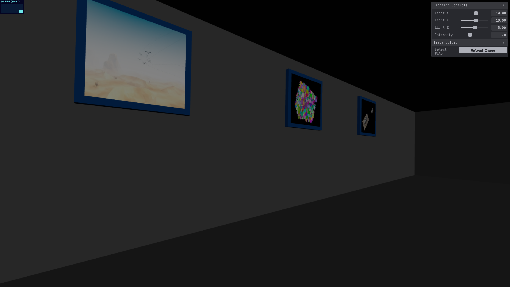

# 3D Hallway Gallery

## Welcome to an immersive 3D virtual art gallery experience!

## Description
3D Hallway Gallery is a browser-based interactive application that creates a virtual 3D hallway where users can upload and display their images as if they were hanging in a real art gallery. Built with Three.js, this application provides a first-person walking experience through an infinitely expandable hallway filled with your personal image collection. Images are  compressed and saved to local storage, which allows you works of art to be saved even when you close tabs!

## Features
- **Immersive 3D First-Person Navigation**: Walk through your virtual gallery using arrow keys and mouse controls
- **Dynamic Gallery Expansion**: Hallway automatically extends as you add more images
- **Persistent Storage**: Images are compressed and saved to browesers local storage.
- **Simple Image Upload**: Upload your own images via a simple file browser
- **Interactive Controls**: Adjust lighting and other gallery settings in real-time

## Installation
1. Open the link in any modern web browser (Chrome, Firefox, Safari, Edge)
2. The application will load immediately

**Requirements:**
- Modern web browser with JavaScript enabled
- Internet connection (for loading Three.js libraries)

## Usage

### Basic Navigation
- **Arrow Keys**: Move forward, backward, left, and right
- **Mouse Drag**: Look around the gallery

### Uploading Images
1. Click the "Select File" button in the "Image Upload" panel
2. Choose any image file from your computer
3. The image will be automatically compressed, added to the gallery, and saved

### Gallery Controls
Use the control panel on the right side of the screen to:
- Adjust lighting position and intensity
- Look at the performance of the virtual gallery specifically the fps in the top left corner.

## How It Works

### Technical Implementation
- **3D Engine**: Three.js for WebGL rendering
- **Storage**: LocalStorage with automatic compression
- **UI Controls**: Tweakpane for interactive parameter adjustment
- **Performance**: Stats.js for frame rate monitoring

### Key Features
1. **Dynamic Hallway Generation**: The hallway extends automatically as you add images
2. **Frame Management**: Each image gets its own framed display on the gallery walls
3. **Memory Management**: Automatic cleanup to prevent memory leaks
4. **Error Handling**: Graceful degradation when localStorage is unavailable

## Future Improvements
- Add gif support
- Add user camera support so the user can upload images taken live
- virtual reality compatibility

## Credits
- **Three.js**: 3D JavaScript library
- **Tweakpane**: Control panel interface
- **Stats.js**: Performance monitoring
- **WebGL**: 3D graphics technology

*Experience your own virtual art exhibition today!*